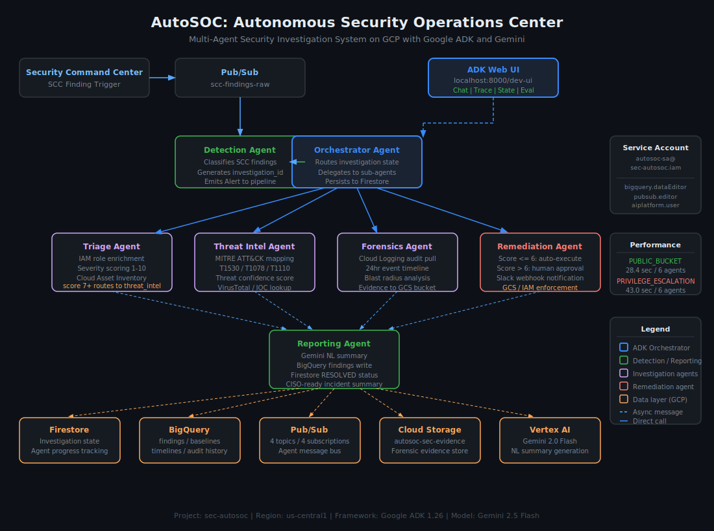

# AutoSOC: Autonomous Security Operations Center

A production-grade multi-agent security investigation system built on GCP using Google Agent Development Kit (ADK) and Gemini. AutoSOC autonomously detects, triages, investigates, remediates, and reports on GCP security findings end to end with no human intervention below the configurable risk threshold.

---

## Architecture



AutoSOC is composed of seven specialized agents that communicate through GCP-native services. Each agent has a discrete responsibility, a defined input contract, and a defined output contract. No agent has direct knowledge of any other agent's implementation.

---

## Agent Pipeline

### 1. Detection Agent
Ingests raw Security Command Center findings from a Pub/Sub subscription. Classifies each finding into a structured `Alert` with an `AlertType` enum (`PUBLIC_BUCKET`, `PRIVILEGE_ESCALATION`, `EXFILTRATION`, `IAM_ANOMALY`, `BRUTE_FORCE`, `MALWARE`, `NETWORK_ANOMALY`), a `SeverityLevel`, and a unique investigation ID in the format `inv-YYYYMMDD-{uuid8}`.

### 2. Orchestrator Agent
Receives the classified alert and creates an `Investigation` state object in Firestore. Routes the investigation to downstream agents and tracks which agents have completed. Manages the state machine transitions: `OPEN` -> `TRIAGING` -> `INVESTIGATING` -> `REMEDIATING` -> `RESOLVED`.

### 3. Triage Agent
Enriches the alert using Cloud Asset Inventory to retrieve IAM roles held by the principal. Scores severity 1-10 using a weighted formula that combines SCC severity, role sensitivity (owner/editor = +2, BigQuery access = +1, Storage access = +1), and behavioral deviation. Investigations scoring >= 6 route to Threat Intel; below 6 route directly to Forensics.

### 4. Threat Intel Agent
Maps the alert type to MITRE ATT&CK techniques using a structured lookup:
- `PUBLIC_BUCKET` -> T1530 (Data from Cloud Storage)
- `PRIVILEGE_ESCALATION` / `IAM_ANOMALY` -> T1078 (Valid Accounts)
- `EXFILTRATION` -> T1537 (Transfer Data to Cloud Account)
- `BRUTE_FORCE` -> T1110 (Brute Force)

Produces a confidence score based on resource name patterns, principal characteristics, and known IOC matches.

### 5. Forensics Agent
Pulls the last 24 hours of Cloud Audit Log entries for the affected resource and principal using the Cloud Logging API. Builds a chronological event timeline. Constructs a blast radius list of resources and principals potentially affected by the incident.

### 6. Remediation Agent
Applies a configurable auto-remediation threshold (default: score <= 6 = auto-execute, score > 6 = human approval required). Auto-executed actions include removing public access prevention enforcement on GCS buckets and disabling overprivileged service accounts. High-risk actions trigger a Slack webhook with the investigation ID, severity score, resource, and recommended action.

### 7. Reporting Agent
Generates a three-sentence CISO-ready natural language summary using Gemini via Vertex AI. Writes a structured `Finding` record to BigQuery `autosoc_data.findings`. Updates the Firestore investigation document to `RESOLVED` with a resolution timestamp.

---

## Tech Stack

| Component | Technology |
|---|---|
| Agent framework | Google ADK 1.26 |
| LLM | Gemini 2.5 Flash (ADK UI) / Gemini 2.0 Flash (Vertex AI reporting) |
| Agent memory | Firestore (investigation state) |
| Event bus | Cloud Pub/Sub (4 topics, 4 subscriptions) |
| Data store | BigQuery (findings, baselines, timelines) |
| Evidence store | Cloud Storage (autosoc-sec-evidence) |
| IAM enrichment | Cloud Asset Inventory API |
| Audit logs | Cloud Logging API |
| Human gate | Slack webhook |
| Dev UI | ADK Web (localhost:8000) |

---

## GCP Infrastructure

### Project
- Project ID: `sec-autosoc`
- Region: `us-central1`

### APIs Enabled
`run.googleapis.com`, `cloudfunctions.googleapis.com`, `pubsub.googleapis.com`, `firestore.googleapis.com`, `bigquery.googleapis.com`, `securitycenter.googleapis.com`, `cloudasset.googleapis.com`, `aiplatform.googleapis.com`, `logging.googleapis.com`, `artifactregistry.googleapis.com`, `storage.googleapis.com`

### Service Account
`autosoc-sa@sec-autosoc.iam.gserviceaccount.com` with roles: `bigquery.dataEditor`, `bigquery.jobUser`, `pubsub.editor`, `datastore.user`, `logging.viewer`, `securitycenter.findingsViewer`, `cloudasset.viewer`, `run.invoker`, `aiplatform.user`, `storage.admin`

### Pub/Sub Topics
| Topic | Subscription |
|---|---|
| scc-findings-raw | scc-findings-sub |
| investigation-events | investigation-events-sub |
| remediation-requests | remediation-requests-sub |
| findings-complete | findings-complete-sub |

### BigQuery
Dataset: `autosoc_data` with tables: `findings`, `baselines`, `timelines`

### Firestore
Default database, Native mode, `nam5` (US multi-region), collection: `investigations`

---

## Setup

### Prerequisites
- Python 3.11+
- GCP project with billing enabled
- `gcloud` CLI authenticated
- ADC configured: `gcloud auth application-default login`

### Install

```bash
git clone https://github.com/yourusername/autosoc
cd autosoc
python -m venv venv
source venv/bin/activate  # Windows: venv\Scripts\Activate.ps1
pip install -r requirements.txt
```

### Configure

```bash
cp .env.example .env
# Edit .env with your PROJECT_ID, LOCATION, GCS_EVIDENCE_BUCKET
# Add GOOGLE_API_KEY from aistudio.google.com/apikey
```

### Verify Infrastructure

```bash
python -m scripts.verify_autosoc
```

All checks should return PASS before running the agents.

### Run ADK Web UI

```bash
adk web .
```

Open `http://localhost:8000`, select `autosoc_agent`, and submit a finding prompt.

---

## Sample Investigation Prompt

```
Investigate this GCP security finding:

Finding ID: finding-001
Category: PUBLIC_BUCKET
Resource: gs://test-exposed-bucket-001
Severity: HIGH
Principal: test-sa@sec-autosoc.iam.gserviceaccount.com

Run the full investigation through all 6 steps.
```

---

## Supported Finding Categories

| Category | MITRE Technique | Auto-Remediation |
|---|---|---|
| PUBLIC_BUCKET | T1530 | Yes (score <= 6) |
| PRIVILEGE_ESCALATION | T1078 | No (always human approval) |
| IAM_ANOMALY | T1078 | Threshold-based |
| EXFILTRATION | T1537 | No |
| BRUTE_FORCE | T1110 | Threshold-based |
| MALWARE | T1204 | No |
| NETWORK_ANOMALY | T1046 | No |

---

## Verification

```bash
python -m scripts.verify_autosoc
```

This script checks all infrastructure components and runs a live end-to-end detection test. Expected output:

```
==============================
  GCP Authentication
==============================
  [PASS] Application Default Credentials: project=sec-autosoc
  [PASS] GCP Project accessible: project_id=sec-autosoc, state=ACTIVE

  ...

  STATUS: ALL CHECKS PASSED - AutoSOC infrastructure is fully operational
```

A full verification pass output is included in [`docs/VERIFICATION_PASS.txt`](docs/VERIFICATION_PASS.txt). This run confirmed 33/33 checks passing across GCP authentication, all 4 Pub/Sub topics and subscriptions, BigQuery dataset and tables (5 live findings), Firestore (3 resolved investigations), Cloud Storage, Vertex AI Gemini, Cloud Asset Inventory, Cloud Logging, all 9 agent module imports, and a live end-to-end detection test.

---

## Project Structure

```
autosoc/
├── .env
├── requirements.txt
├── autosoc_agent/
│   ├── __init__.py
│   └── agent.py          # ADK root_agent with 6 tools
├── agents/
│   ├── detection/agent.py
│   ├── orchestrator/agent.py
│   ├── triage/agent.py
│   ├── threat_intel/agent.py
│   ├── forensics/agent.py
│   ├── remediation/agent.py
│   └── reporting/agent.py
├── shared/
│   ├── config.py         # All constants and configuration
│   ├── models.py         # Pydantic models for all data structures
│   └── pubsub_client.py  # Pub/Sub publish/subscribe utilities
├── docs/
│   ├── architecture.svg          # System architecture diagram
│   ├── VERIFICATION_PASS.txt     # Live 33/33 infrastructure verification
│   └── QA.md                     # In-depth technical Q&A
└── tools/                # Future: discrete GCP tool functions
```


---

## Q&A

See [docs/QA.md](docs/QA.md) for in-depth answers covering ADK vs Vertex AI Agent Builder, inter-agent communication design, human-in-the-loop architecture, Firestore vs BigQuery, severity scoring, failure recovery, production deployment, cost, and security controls.

---

## Investigation Examples

### PUBLIC_BUCKET (Score 7/10)
- MITRE: T1530 (Data from Cloud Storage)
- Blast radius: all objects publicly accessible, service accounts with storage access implicated
- Remediation: human approval requested (score > 6)
- Resolution time: 28 seconds

### PRIVILEGE_ESCALATION (Score 8/10)
- MITRE: T1078 (Valid Accounts)
- Blast radius: elevated permissions allow lateral movement, all resources accessible by principal at risk
- Remediation: human approval requested (CRITICAL severity)
- Resolution time: 43 seconds

---

## License

MIT
